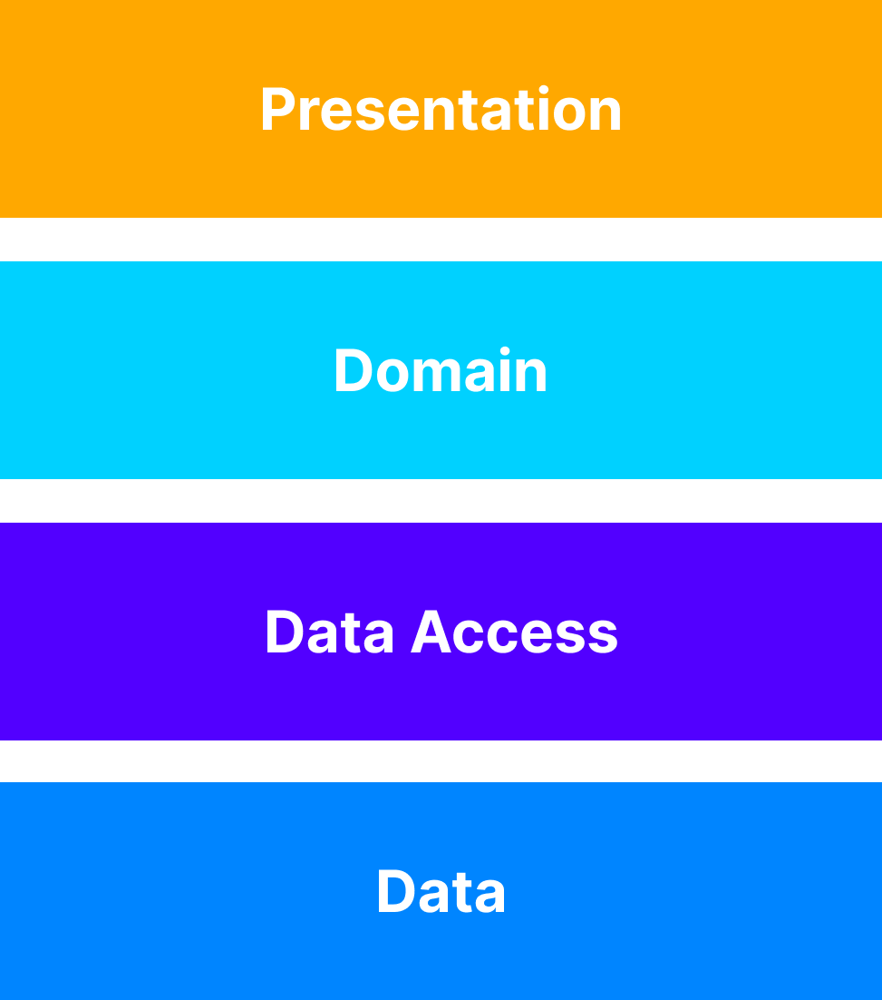

# Getting Started

In order to get started, you'll be shown the bases and main principles of our frontend projects.

* [Layered Architecture](#layered-architecture)
* [SOLID Principles](#solid-principles)
* [Frontend 1.0 vs Frontend 2.0](#frontend-10-vs-frontend-20)

## Layered Architecture

The most common architecture pattern is the layered architecture pattern, otherwise known as the n-tier architecture pattern.

Components within the layered architecture pattern are organized into horizontal layers, each layer performing a specific role within the application (e.g., presentation logic or business logic). Layered architecture doesn't specify the number and types of layers that must exist in the pattern. However, most layered architectures consist of four layers:

* **UI or Presentation**: Logic related to the UI of the application
* **Domain or Business**: Logic related to the domain of the application
* **Data Access or Persistence**: Logic related to the access of data of the application
* **Data**: Logic related to the storage of the data of the application

</img>

## SOLID Principles

SOLID is an acronym for the first five object-oriented design (OOD) principles by Robert C. Martin.

These principles establish practices that lend to developing software with considerations for maintaining and extending as the project grows. Adopting these practices can also contribute to avoiding code smells, refactoring code, and Agile or Adaptive software development.

SOLID stands for:

* **S** - Single-responsiblity Principle
  * Objects have one and only one reason to change, meaning that a class should have only one job.
* **O** - Open-closed Principle
  * Objects or entities should be open for extension but closed for modification
* **L** - Liskov Substitution Principle
  * Every subclass or derived class should be substitutable for their base or parent class
* **I** - Interface Segregation Principle
  * A client should never be forced to implement an interface that it doesn’t use, or clients shouldn’t be forced to depend on methods they do not use
* **D** - Dependency Inversion Principle
  * Entities must depend on abstractions, not on concretions. It states that the high-level module must not depend on the low-level module, but they should depend on abstractions

## Frontend 1.0 vs Frontend 2.0

Why 2.0? What was Frontend 1.0 and how does Frontend 2.0 improve that first version? To see that, we built a table with the main differences.

|                      | **1.0**                                                                                                                      | **2.0**                                                                                       |
|----------------------|--------------------------------------------------------------------------------------------------------------------------|-------------------------------------------------------------------------------------------|
| **Architecture**         | UI coupled with a single Domain-Data Access group                                                                        | Layered (Loosely coupled application)                                                     |
| **S Principle**          | Not respected sometimes due to the coupling between different parts of the application                                   | Always respected                                                                          |
| **O Principle**          | Always respected                                                                                                         | Always respected                                                                          |
| **L Principle**          | Always respected                                                                                                         | Always respected                                                                          |
| **I Principle**          | Not applicable                                                                                                           | Always respected                                                                          |
| **D Principle**          | Almost never respected                                                                                                   | Always respected                                                                          |
| **Testing**              | Too many UI tests, which ended up merging unit tests with integration tests. Not scalable, chaotic when the project grew | Distributed unit testing across layers. Much more scalable and controlled                 |
| **Portability**          | Required a very high effort to port applications **only** between React or React Native applications                     | Much lower effort to port applications anywhere                                           |
| **Tolerance**            | Quite high tolerance to changes                                                                                          | Much higher tolerance to changes                                                          |
| **Package dependencies** | Dependency on React / React Native and recoil                                                                            | No real dependency                                                                        |
| **Code quality**        | Good code quality                                                                                                        | Much better code quality                                                                  |
| **Complexity**           | Less complex at the start but complexity increases as the project grows                                                  | More complex at the start but the complexity is pretty much the same as the project grows |
